# Fullstack GCP App - DevSecOps Pipeline 🚀

Repositori ini (`app-gcp`) menyimpan *source code* murni dari arsitektur Fullstack Go (Backend) dan React.js (Frontend). Di dalamnya juga terdapat skema **Continuous Integration / Continuous Deployment (CI/CD)** kelas *Enterprise* yang dirancang tahan banting dengan *Security Checks* tingkat tinggi.

## 🌟 CI/CD Pipeline Architecture

```mermaid
sequenceDiagram
    participant Dev as Developer
    participant Git as GitHub Repository
    participant Runner as DevOps VM<br/>(GitHub Runner)
    participant GHCR as GitHub Registry
    participant AppVM as App VM<br/>(Watchtower)
    
    Dev->>Git: 1. git push origin main
    Git->>Runner: 2. Trigger Workflow (prod-deploy.yml)
    
    rect rgb(40, 40, 40)
        Note over Runner: CI: Security & Quality Gate
        Runner->>Runner: 3. SonarQube Scan (Code Quality)
        Runner->>Runner: 4. Trivy Scan (CVE Vulnerabilities)
    end
    
    rect rgb(20, 50, 20)
        Note over Runner: CI: Build & Delivery
        Runner->>GHCR: 5. Build & Push Backend:latest
        Runner->>GHCR: 6. Build & Push Frontend:latest
    end
    
    rect rgb(20, 20, 50)
        Note over AppVM: CD: Continuous Deployment
        AppVM->>GHCR: 7. Polls for changes (every 60s)
        GHCR-->>AppVM: Detects new :latest Image
        AppVM->>AppVM: 8. Pull Image & Graceful Restart
    end
    
    AppVM-->>Dev: 9. App Updated with Zero Downtime!
```

Semua proses validasi, pemeriksaan celah keamanan (CVE), dan *Deployment Release* dikontrol secara terpusat oleh **GitHub Actions** (`.github/workflows/prod-deploy.yml`).

Pipieline ini tidak di-*running* menggunakan mesin publik bawaan GitHub, melainkan menggunakan agen mandiri (**Self-Hosted Runner**) yang bersemayam hidup di dalam Virtual Machine Google Cloud kita sendiri.

### Skema Alur DevSecOps (Garis Besar):
Setiap kali ada fitur baru yang di-*Push* ke *branch* `main`, robot CI/CD bakal bekerja secara instan:

1. **Gate 1: SonarQube Quality Check 🛡️**
   Robocop virtual *(SonarCloud)* turun tangan mencari letak kode busuk (*Code Smells*), kelemahan sintaks (*Bugs*), dan mengukur kebersihan kualitas aplikasi Go / Node.js secara keseluruhan sebelum bisa menembus gawang.
   
2. **Gate 2: Aqua Trivy Vulnerability Scan 🔒**
   Aplikasi dan *package modules* (NPM / Go Mods) kemudian akan dibongkar oleh anjing pelacak *Aqua Trivy* untuk mendeteksi ancaman siber CVE (*Common Vulnerabilities and Exposures*). Jika terdeteksi lubang *CRITICAL* atau *HIGH*, pipa rilis akan segera diputus (Error).

3. **Gate 3: Build & Publish to GHCR 📦**
   Bila kode lu selamat dari 2 mesin pembantai keamanan di atas, agen Runner dalam VM DevOps lu bakal merakit Image Docker final. Image ini kemudian akan dikirim pulang (*Push*) ke dalam gudang kontainer rahasia GitHub (Target: `ghcr.io/ichramsyah/app-gcp-backend:latest` & `app-gcp-frontend:latest`).

4. **Gate 4: Watchtower CD (Deployment Otomatis) 🤖**
   Jauh di seberang sana pada **App VM**, sang robot **Watchtower** yang bertugas jaga malam akan menyadari perubahan Image di gudang GHCR lu dalam kurun interval 60 detik. Secara senyap, ia akan menarik (*Pull*) Image yang baru turun tersebut, lalu me-*restart* kontainer *Backend/Frontend* tanpa interupsi sedikit pun!

### 🔑 Seting Mandat (Prerequisites Rahasia)
Untuk membuat rangkaian malaikat ini hidup di repositori lu, lu wajib menyelipkan "Kunci Kerajaan" di menu **Settings -> Secrets and variables -> Actions**:
* `SONAR_TOKEN`: Token rahasia yang digenerate gratis dari dashboard SonarCloud lu.

*(Catatan: Rahasia token GitHub buat mengunggah Image GHCR tak pelak lagi udah dibungkus murni dari GitHub Robot, ga butuh PAT lu lagi)*
